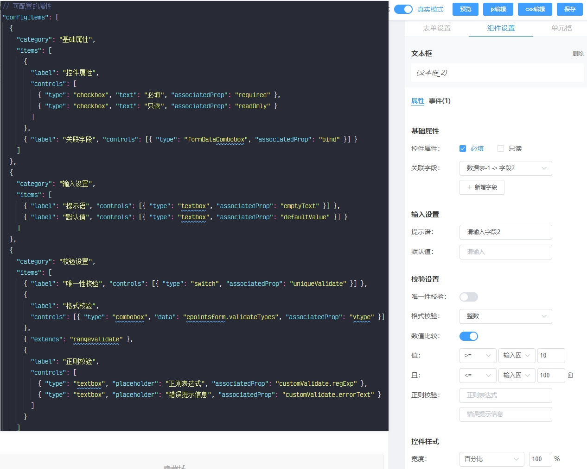

# 2019

2019似乎眨眼间就过去了，这一定是加班太多，导致我都没有时间来感慨生活了。

## 丰富认知

### 听得到

罗胖是不是贩卖焦虑的我不知道，知识付费是不是大忽悠我也不在乎。不过我只是在上下班路上听听得到，遇到有共鸣的，自己也做点小笔记而已。

“纸上得来终觉浅，绝知此事要躬行”。你要想练真本事，学大智慧，还不得靠自己。 就像我们程序员，没踏实地写过代码，能成长嘛。

### 读书

“书是人类进步的阶梯”多读书，总是好的，万一就用用上了呢。2019大致读了下面这些书：

- 刺杀骑士团长
- 刻意练习
- 亲密关系
- 如何阅读一本书
- 城南旧事
- 浮生六记
- 腾讯传
- 周鸿祎自诉：我的互联网方法论
- 图解http
- 球状闪电
- 思考快与慢
- 万万没想到
- 历史的第三种读法
- 浪潮之巅
- 学会写作（刘杨）
- HTTP2基础教程

差不多是一月一本的进度。虽然量比较少，但是与我来说，有空就读读书已经基本成了小习惯，也算是一种进步，特此记录。

上面所列出的图书中，有以下基本是我个人极为不推荐的：

- 浮生六记： 在微信读书里面看的这本书，评论中有一句非常经典“渣男界的泥石流”，想看他是怎么渣的可以去读读。
- 周鸿祎自诉 我的互联网方法论：兴许是我没读懂，感觉没讲到什么内容，实际是在360做宣传。

总结来说就是读的有点少，尤其是技术类的。2020 keep。

## 关于工作

2019是我在这公司的第三年了，顺利升为了二星工程师，很多想法，只奈公司太大，项目紧迫，很多东西都不能真正落实。

与我个人成长而言，值得说道的项目有如下两个：表单设计器和组件库重写升级。

### 表单设计器

简单来说就是可视化创建表单，动态配置或创建字段信息，然后生成实际真实可用的页面。

在这个产品中，终于力排众议用上了Vue技术栈。也算是一个里程碑式的时刻了，为什么这么说呢？公司可一直用的是ES3，我在公司三年，写代码的的百分之九十也是ES3。

布局层面上，摒弃了旧版本上利用富文本编辑器中表格来布局的传统，使用行列并支持内部再次嵌套的模式来实现。边框等的配置使用最内层的元素边框来拼接。相关的拖拽交互应用了 [Sortable](https://github.com/SortableJS/Sortable) 来实现。边框的配置以及拖拽时的吸附，在整个开发过程中也是下了不少功夫，受益良多。

表单控件的配置性上是此设计器最大的亮点。业务上表单上所用的控件肯定各有特色，表单设计器引擎本身肯定无法穷举。因此对表单控件的配置做了进一步抽象，设计器本身不提供任何表单控件配置的实现。需要哪些控件、每个控件有些什么配置，均为外部配置文件控制，大大提示了表单设计器的适用场景。

大致如下图所示：

如上所示的文本输入框，整个右侧配置面板均是左侧的json文件生成。配置面板本身只用负责将相应属性的修改反应到对应的控件属性值上即可。

此外还有支持撤销还原的操作栈、事件配置、连动设值、动态显隐藏等，简单说实现这些个功能点其实都不算太难，但是要考虑作为通用产品，要处理的细节还是不少，具体就不在这里一一赘述了。

### 组件库升级

因为原来的组件库样式老旧，有点跟不上新时代了。因此在今年对组件库进行了升级。

本次升级中，样式部分全部重新写，js实现上重写了百分之五十以上的代码。设计大多参考了 [Ant Design](https://ant.design/)。 组件开发升级过程中研究了一部分 iview 的源码，为表格新增了很多功能，目前来说 iview 表格所具备的功能，我们的组件库也全部具备了。所不同的是， iview 是用 vue 写的，我们的组件库还是jQuery的。但是有啥关系呢？这些东西对客户和使用者是透明的，作为公司的框架开发人员，服务好我们的开发人员，支持好我们的项目开发才是最关键的。

组件库的升级过程中，顺手花了些功夫，把代码从ES3全面迁移到了ES5，（不支持的环境下自动用 shim），数组上的方法基本可以随便玩了，是爽了不少。虽然不知道这套组件库生命周期还能有多久，在其位谋其事，我尽力了。

- - - - --

在这两个项目中，我也尽个人绵薄之力，将整个流程弄上了现在的自动化。简单来说也就是如下几步：

1. svn仓库迁移到私有git上， git主分支提交/合并的时候，自动同步代码到svn仓库。
2. 每个小功能都一用 commit 再用 Jenkins 做持续集成，出错则报警。
3. 主分支有提交且持续集成通过的情况下，演示服务器拉取更新，构建再自动更新替换演示系统。

搞了整个流程的自动化，沟通过程轻松了不少。 演示系统上始终是最新且可用的，即方便沟通和测试。领导要看嘛，演示系统有，git提交记录也清楚明白。

程序员就敢于偷懒，不做无意义的重复工作。不过省下来的时间，似乎最后又都花在了写新的代码上。💁‍♂

## 未来

未来从来都不远，下一秒、明天都是未来，所以重要的是在路上，现在在干什么。Just Keep。

