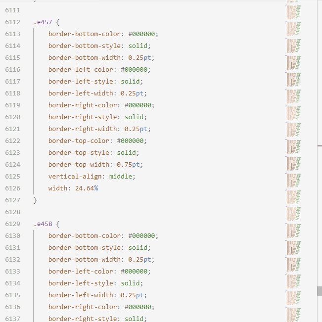

# 通过AST来优化css


最近拿到一个优化减少css体积的需求，一些有word转化html生成的css如下所示：



如 `border` 、 `background`  这样的属性全部被逐个拆分开来写，而且重复性非常高，注意看上图右边的mini-map，导致文件体积很大。

想要对其进行优化，那么就首要任务就是尽可能地合并这些可以合并简写的css属性。

而拿到的只有一个css文件的的文本，如何进行操作？这些属性到是可以用正则匹配，那么怎么合并，如何再修改回去都是大问题。

那么此时就轮到AST上场了。

## 什么是AST

**AST** 即抽象语法树（abstract syntax tree）是源代码的抽象语法结构的树状表现形式。更多细节请自行查阅[google](https://www.google.com/search?q=ast&oq=ast) [百度](https://www.baidu.com/s?wd=AST)

我们使用的IDE，编辑器等插件，代码的提示和检查很多都基于AST。

## css转AST

此处转化AST直接使用 `postcss.parse()` 来完成，关于postcss 请戳  [https://postcss.org/](https://postcss.org/)

以如下css代码为例：

```css
.e82 {
    border-bottom-color: #000000;
    border-bottom-style: solid; 
    border-bottom-width: 0.5pt;
    border-left-color: #000000;
    border-left-style: solid;
    border-left-width: 0.5pt;
    border-right-color: #000000;
    border-right-style: solid;
    border-right-width: 0.5pt;
    border-top-color: #000000;
    border-top-style: solid;
    border-top-width: 0.5pt;
}
@media screen and (max-device-width:425px) {
    .form-label {
        width: 100%;
        text-align: left
    }

    .form-control {
        width: 100% !important;
        padding-left: 0;
        background: #ddd
    }
}
```

`postcss.parse` 生成的结果如下：


经过处理，其已经将字符串文本转化为一个树状结构：

- root下直接有两个节点 其中一个为普通css选择器另一个为媒体查询
- 普通选择器下，每个节点即为每条规则，包含了 `prop` 和 `value`
- 媒体查询中，每个节点即为其中包含的选择器

有了这样的树状结构，操作css就相对于大片的文本简单多了。

## 规则排序

进行处理前，先将每个选择器下的css规则进行排序，进行排序的好处方便候选查找。

以下面的合并边框为例：如果未排序，拿到 `border-bottom-color: #000000;` 后与之相关的 `border-bottom-style: solid;` 和 `border-bottom-width: 0.5pt;` 不一定在连续的后面两个位置，需要再次遍历查找，处理过程将会很麻烦。

此处直接使用 [postcss-sorting](https://github.com/hudochenkov/postcss-sorting) 进行规制排序。

## 合并边框

由于边框都是分四个方向加每个方向的三个值来书写的，应首先合并每个方向的两个或三个属性值，完成之后再检查四个方向的边框，看能否合并成一个属性。

首先是合并每个方向的两到三个属性值：

```js
const borderSubReg = /^border-(top|left|bottom|right)-(?:width|style|color)/;
/**
 * 合并边框子属性
 * @param {Array<ruleObject>} array 每个选择器下的所有属性
 * @example
 * input "border-bottom-color: #000000;
 *        border-bottom-style: solid; 
 *        border-bottom-width: 0.5pt;"
 * output "border-bottom: #000000 solid 0.5pt;"
 */
function dealborderSub(array) {
    for (let index = 0; index < array.length; index++) {
        const rule = array[index];
        const res = rule.prop.match(borderSubReg);
        // 后面的数目不足时 直接结束
        if (index + 1 > array.length - 1) break;
        if (res && res.length) {
            const next1 = array[index + 1];
            const next2 = array[index + 2];

            // 根据匹配到的 方向之一构造新的正则
            const forwordReg = new RegExp('border-' + res[1] + '-(?:width|style|color)');
            const match1 = forwordReg.test(next1.prop);
            const match2 = next2 && forwordReg.test(next2.prop);

            if (!match1 && !match2) continue;

            if (match1 && match2) {
                rule.prop = 'border-' + res[1];
                rule.value = `${rule.value} ${next1.value} ${next2.value}`;
                next1.remove();
                next2.remove();
                // array.splice(index + 1, 2);
                continue;
            }
            if (match1 && !match2) {
                rule.prop = 'border-' + res[1];
                rule.value = `${rule.value} ${next1.value}`;
                // array.splice(index + 1, 1);
                next1.remove();
                continue;
            }
        }
    }
    return array;
}
```

接着检查四个方向的边框能否合并为一个，此操作要待上一个操作完成后才能进行

```js
const borderReg = /^border-(top|left|bottom|right)$/;
/**
 * 合并边框
 * @param {Array<ruleObject>} array 每个选择器下的所有属性3
 * @example
 * input "border-bottom: #000000 solid 0.5pt;
 *        border-top: #000000 solid 0.5pt;
 *        border-left: #000000 solid 0.5pt;
 *        border-right: #000000 solid 0.5pt;"
 * output "border: #000000 solid 0.5pt;"
 */
function dealBorder(array) {
    if (array.length < 4) return array;
    for (let index = 0; index < array.length; index++) {
        if (index + 3 > array.length - 1) {
            break;
        }
        const rule = array[index];
        const res = rule.prop.match(borderReg);

        //  如果有匹配 检查后面3个
        if (res && res.length) {
            const next1 = array[index + 1];
            const next2 = array[index + 2];
            const next3 = array[index + 3];
            if (borderReg.test(next1.prop) && next1.value == rule.value &&
                borderReg.test(next2.prop) && next2.value == rule.value &&
                borderReg.test(next3.prop) && next3.value == rule.value
            ) {
                rule.prop = 'border';
                next1.remove();
                next2.remove();
                next3.remove();
            }
            return array;
        }
    }
}
```

## 颜色简写

如果颜色是 `#000000` 我们通常会写为 `#000` , 因为简单，容易识别，而且字符少。

对颜色进行简写处理，首先则需匹配出属性值中是否包含颜色。

经过我的试验，构造了一下正则表达式：

```JavaScript
// 行开始 或 空白开始
// # 数字或a-fA-F
// 以空白、换行、分号逗号 或行尾结束
const reg = /(^|\s+)(#[\dA-Fa-f]{6})((?:,|;|\s|\r|\n|\r\n|$)+)/;
```

可视化如下：


可浏览器访问 [https://regexper.com/](https://regexper.com/#%2F%28%5E%7C%5Cs%2B%29%28%23%5B%5CdA-Fa-f%5D%7B6%7D%29%28%28%3F%3A%2C%7C%3B%7C%5Cs%7C%5Cr%7C%5Cn%7C%5Cr%5Cn%7C%24%29%2B%29%2F) 或 [https://jex.im/regulex/](https://jex.im/regulex/#!flags=&re=(%5E%7C%5Cs%2B)(%23%5B%5CdA-Fa-f%5D%7B6%7D)((%3F%3A%2C%7C%3B%7C%5Cs%7C%5Cr%7C%5Cn%7C%5Cr%5Cn%7C%24)%2B))输入以上代码修改查看。

或许你会想不就一个颜色吗，直接 `/#[\dA-Fa-f]{6}/` 不就行了，怎么会有那么一大串？颜色虽然如此，但并非是属性值中仅有颜色，考虑以下规则：

- `box-shadow: 0 0 3px #000000, 0 0 0 2px #ffffff;`
- `background: #000000 url('xxx') center no-repeat;`
- `border:1px solid #333333;`
- `border-top:5px #000000`

而且由于不只是颜色，可能还有其他值，只需要修改颜色，而不能变成只有颜色，因此其他部分是必不可少的。

以此正则表达式进行匹配：

- 分组1位颜色之前的内容
- 分组2为颜色本身
- 分组3位颜色后面的内容

捕获到如上内容后，对分组2中颜色值进行判断，如果可合并修改为新的值，在拼接上分组1和3即可将原来的属性值中的颜色进行简写。

换成代码就是：

```js
/**
 * 颜色缩短为简写
 * @param {Array<ruleObject>} rules 每个选择器下的所有属性
 * @example
 * input "border: #000000 solid 0.5pt;"
 * output "border: #000 solid 0.5pt;"
 */
function shortColor(rules) {
    // 行开始 或 空白开始
    // # +数字或a-f
    // 以空白、换行、分号逗号 或行尾结束
    const reg = /(^|\s+)(#[\dA-Fa-f]{6})((?:,|;|\s|\r|\n|\r\n|$)+)/;
    rules.forEach(rule => {
        var matched = rule.value.match(reg)
        if (matched && matched.length) {
            let enableShort = true;
            const value = matched[2].substr(1);
            let i = 0;
            while (i < 4) {
                enableShort = value[i] === value[i + 1];
                if (!enableShort) break;
                i += 2;
            }
            if (enableShort) rule.value = rule.value.replace(reg, `$1#${value[0]}${value[2]}${value[4]}$3`);
        }
    });
}
```

其他需要处理的可以进行相类似的处理。如每个选择器中最后一条规则的分号移除、url中引号移除、空白移除等，不过这些通过任意的css压缩都可以实现，这里就没有手动进行修改。

## 还原AST为css文本

当所有处理都完成的时候使用ast实例的 `toResult` 方法将其转化为css文本。

## 后记

针对需求的上提供的css文件，进行如上操作可将文件体积由125kb减小到35kb，减少体积还是非常大的。

不过这些操作未进行严格操作测试，不确定处理是否完全正确。
